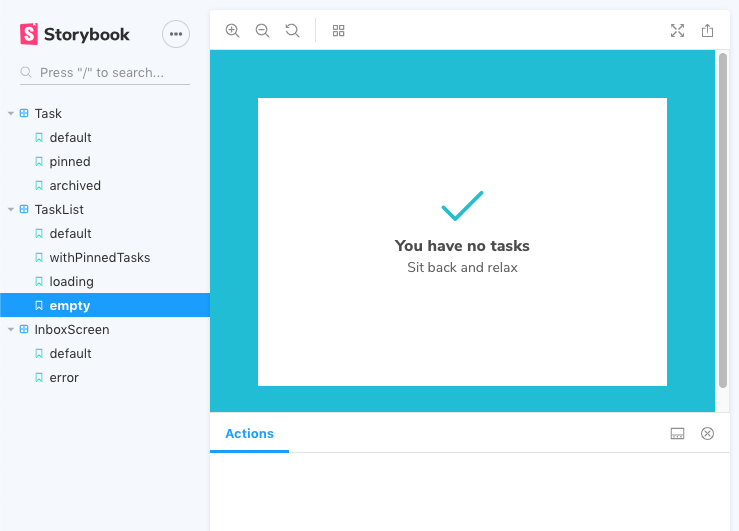

# Storybook Driven Development

### Description
>_Task management UI built using [Component Driven Development](https://medium.com/nulogy/storybook-driven-development-a3c517276c07)_

UI            |  Storybook
------------- | -------------
 | 

### UI Component Testing
* Visual tests 
* Snapshot tests with Storyshots
* Unit tests with Jest
* Regression Testing with [Chromatic](https://www.chromaticqa.com/)

### Resources
>_tutorial from [Learn Storybook](https://www.learnstorybook.com/)_
